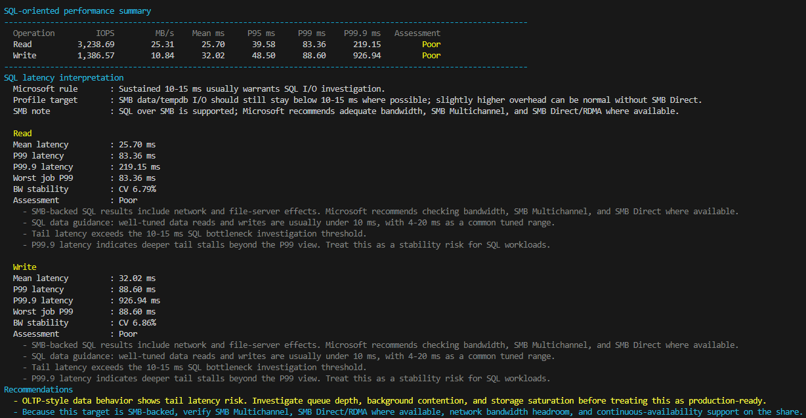
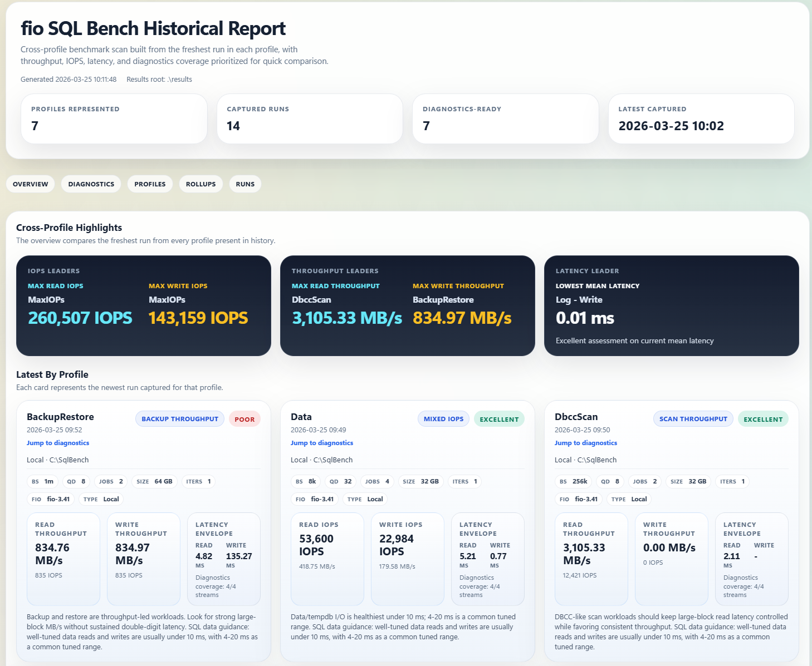

# fio-sql-bench

`fio-sql-bench` is a Windows-first PowerShell harness for running file-based `fio` benchmarks that approximate common SQL Server storage patterns on either local disks or SMB shares. It produces SQL-oriented console interpretation, per-run JSON/CSV/HTML artifacts, and a historical HTML dashboard for comparing profile baselines over time.

## First Run

If Windows marked the repo contents as downloaded files, unblock them before running the scripts:

```powershell
Get-ChildItem -Recurse | Unblock-File
```

If your current user policy does not yet allow local signed scripts, set it once for the current user:

```powershell
Set-ExecutionPolicy -ExecutionPolicy RemoteSigned -Scope CurrentUser
```

## Scope

Version 1 stays intentionally narrow:

- File-based tests only
- Missing target directories are created automatically
- Local paths, UNC paths, and mapped SMB drives supported
- Eight built-in workload profiles: `Data`, `Log`, `Tempdb`, `BackupRestore`, `DbccScan`, `MaxThroughput`, `MaxIOPs`, `All`
- Structured JSON, CSV, and HTML output per run
- Historical rollup reporting across multiple result folders

## Current Highlights

- Native self-contained HTML reports for both per-run and historical views; no external module is required to render the dashboards.
- Compatible with both PowerShell 7 and Windows PowerShell 5.1, including Windows Server builds where `ConvertFrom-Json -Depth` is unavailable.
- SQL-aware latency interpretation in the console and HTML, including `P99.9`, worst-worker `P99`, and stability (`CV`) indicators.
- Optional `-EnableLogs` telemetry that captures windowed fio throughput, IOPS, and completion-latency logs and, on SMB targets, host-side SMB client PerfMon counters for latency, queue depth, and credit stalls.
- Diagnostics charts focus on steady-state behavior by trimming early warmup windows, applying light smoothing, and capping isolated burst spikes in the rendered view.
- Optional fio pacing caps via `-ThroughputCapMBps` and `-IopsCap`, with workload-aware limiter selection when both are supplied.
- Optional `-Optimized` SMB mode that applies a benchmark-oriented client tuning pass for the active run and restores the original settings afterward.
- An `All` profile that runs the built-in workload set in an efficiency-oriented order and emits one parent historical report for the batch.
- Historical dashboards that keep profiles separated, compare each run against the previous run in the same profile, surface diagnostics readiness explicitly, and call out steady-state averages separately from peak observed values.

Raw device benchmarking is intentionally blocked to reduce destructive risk.

## Prerequisites

- PowerShell 7 or Windows PowerShell 5.1
- A local `fio.exe` under `tools/fio/windows-x64`, or `fio.exe` installed and available on `PATH`, or passed with `-FioPath`
  - The runner prefers a repo-local copy under `tools/fio/windows-x64` before checking machine-wide installs.
  - The `tools/fio/` folder is intended for local machine setup and is ignored by git.
  - You can find *fio* from the releases page of [Fio](https://github.com/axboe/fio)
- Permission to create a dedicated test directory on the target volume or SMB share

The script looks for `fio.exe` in:

- `tools/fio/windows-x64/fio.exe`
- `tools/fio/fio.exe`
- `PATH`
- `C:\Program Files\fio\fio.exe`
- `C:\Program Files (x86)\fio\fio.exe`

## Workload Profiles

| Profile | Purpose | Default Working Set | Key fio Defaults | Notes |
| --- | --- | --- | --- | --- |
| `Data` | Approximates OLTP data file traffic. | `32 GB` | `rw=randrw`, `bs=8k`, `rwmixread=70`, `iodepth=32`, `numjobs=4` | Sized to push past common filesystem and memory-cache effects. |
| `Log` | Approximates log writer behavior. | `8 GB` | `rw=write`, `bs=64k`, `iodepth=1`, `numjobs=1`, `fsync=1` | Direct I/O is enabled by default so client-side buffering is less likely to hide commit latency. |
| `Tempdb` | Approximates scratch-heavy tempdb activity. | `16 GB` | `rw=randrw`, `bs=8k`, `rwmixread=50`, `iodepth=32`, `numjobs=8` | Tuned to reduce the chance that results are dominated by cache residency. |
| `BackupRestore` | Approximates large-block backup or restore transfer behavior. | `64 GB` | `rw=rw`, `bs=1m`, `rwmixread=50`, `iodepth=8`, `numjobs=2` | Uses a larger transfer size so sequential throughput is measured with a realistic working set. |
| `DbccScan` | Approximates DBCC-style large-block scan reads. | `32 GB` | `rw=read`, `bs=256k`, `iodepth=8`, `numjobs=2` | Focused on large-block read scan behavior. |
| `MaxThroughput` | Targets best-case path saturation for raw sequential transfer testing on local storage or SMB shares. | `64 GB` | `bs=1m`, `iodepth=32`, `numjobs=4` | Runs two isolated phases against the same prepared files: sequential `read`, then sequential `write`, so each direction can be measured near the path limit. |
| `MaxIOPs` | Targets best-case small-block random I/O saturation for peak read and write IOPS testing. | `32 GB` | `bs=4k`, `iodepth=64`, `numjobs=8` | Runs two isolated phases against the same prepared files: `randread`, then `randwrite`. |

Batch profile behavior:

| Profile | Execution Model | Output |
| --- | --- | --- |
| `All` | Runs `MaxThroughput`, `Data`, `DbccScan`, `BackupRestore`, `MaxIOPs`, `Tempdb`, and `Log` in a reuse-friendly order so compatible prepared files can be shared across child runs. | Writes child run folders plus `historical-summary.json`, `historical-summary.csv`, and `historical-report.html` under one parent result folder. |

## Usage

Show built-in help:

```powershell
.\scripts\Invoke-FioSqlBench.ps1 -Help
```

If you want the script to emit the structured PowerShell result object in addition to the friendly console output, add `-PassThru`.

Dry-run the generated job and effective settings:

```powershell
.\scripts\Invoke-FioSqlBench.ps1 `
  -TargetPath 'C:\SqlBench' `
  -Profile Data `
  -DryRun
```

Run against a local folder and keep the generated workload files for inspection:

```powershell
.\scripts\Invoke-FioSqlBench.ps1 `
  -TargetPath 'D:\SqlBench' `
  -Profile Data `
  -Iterations 3 `
  -KeepJobFile `
  -NoCleanup
```

If `-TargetPath` does not exist yet, the script creates that directory before generating benchmark files.

Target detection is automatic by default. UNC paths and mapped network drives such as `Z:` are treated as SMB targets, while ordinary drive-letter paths on local volumes are treated as local storage.

Benchmark file preparation is now less expensive than the original implementation:

- Prepared files are built once per run and then reused across all iterations in that run.
- The prep phase now uses larger sequential writes than the measured workload so SMB and other remote targets do not spend excessive time creating files with 8K synchronous I/O.
- Pure write workloads such as the built-in `Log` profile skip the prep phase entirely because no pre-existing read surface is required.
- If you are repeatedly testing the same target with the same settings, `-ReusePreparedFiles` keeps a validated prep cache under the target path and reuses it on later runs. This is especially helpful for slower SMB targets.
- The `All` profile automatically groups compatible workloads so `MaxThroughput` can seed `Data` and `DbccScan`, while `MaxIOPs` can seed `Tempdb`, reducing redundant prep I/O inside the same batch run.

The built-in `Data` and `Tempdb` profiles now default to larger working sets (`32 GB` and `16 GB`) so short benches are less likely to be dominated by RAM or filesystem cache effects.

The harness now prints a cache-bypass assessment before execution. This is important because `direct=1` can bypass the Windows page cache for local `windowsaio` runs, and the built-in profiles now request direct I/O by default for SMB as well to reduce client-side cache effects. It still cannot generically bypass SSD controller DRAM, RAID cache, or SMB server-side cache. Very small working sets can still produce inflated numbers even when local page cache bypass is active.

Run against an SMB share with explicit buffered I/O:

```powershell
.\scripts\Invoke-FioSqlBench.ps1 `
  -TargetPath '\\fileserver\sqlbench' `
  -Profile Log `
  -Direct Off
```

Run against a mapped SMB drive and let the script auto-detect it as SMB:

```powershell
.\scripts\Invoke-FioSqlBench.ps1 `
  -TargetPath 'Z:\SqlBench' `
  -Profile Data
```

Enable chartable fio diagnostics for throughput, IOPS, and latency time series:

```powershell
.\scripts\Invoke-FioSqlBench.ps1 `
  -TargetPath 'D:\SqlBench' `
  -Profile MaxThroughput `
  -EnableLogs
```

Capture SMB-side diagnostics as well when running against a share:

```powershell
.\scripts\Invoke-FioSqlBench.ps1 `
  -TargetPath '\\fileserver\sqlbench' `
  -Profile MaxThroughput `
  -EnableLogs
```

Reuse previously prepared files for repeated runs against the same target and settings:

```powershell
.\scripts\Invoke-FioSqlBench.ps1 `
  -TargetPath 'Z:\SqlBench' `
  -Profile Data `
  -ReusePreparedFiles
```

Override defaults for a custom SQL-like test while still using a built-in profile baseline:

```powershell
.\scripts\Invoke-FioSqlBench.ps1 `
  -TargetPath 'D:\SqlBench' `
  -Profile Tempdb `
  -FileSizeGB 32 `
  -RuntimeSec 120 `
  -QueueDepth 64 `
  -NumJobs 16
```

Dry-run the newer large-block profiles:

```powershell
.\scripts\Invoke-FioSqlBench.ps1 `
  -TargetPath 'D:\SqlBench' `
  -Profile BackupRestore `
  -DryRun

.\scripts\Invoke-FioSqlBench.ps1 `
  -TargetPath 'D:\SqlBench' `
  -Profile DbccScan `
  -DryRun

.\scripts\Invoke-FioSqlBench.ps1 `
  -TargetPath 'D:\SqlBench' `
  -Profile MaxThroughput `
  -DryRun

.\scripts\Invoke-FioSqlBench.ps1 `
  -TargetPath 'D:\SqlBench' `
  -Profile MaxIOPs `
  -DryRun

.\scripts\Invoke-FioSqlBench.ps1 `
  -TargetPath 'D:\SqlBench' `
  -Profile All `
  -DryRun
```

Apply a throughput cap to a large-block profile:

```powershell
.\scripts\Invoke-FioSqlBench.ps1 `
  -TargetPath '\\fileserver\sqlbench' `
  -Profile MaxThroughput `
  -ThroughputCapMBps 250
```

Apply an IOPS cap to a small-block profile:

```powershell
.\scripts\Invoke-FioSqlBench.ps1 `
  -TargetPath 'D:\SqlBench' `
  -Profile Data `
  -IopsCap 30000
```

When both caps are supplied, the runner only applies the relevant limiter for that workload. Large-block profiles such as `MaxThroughput`, `DbccScan`, and `BackupRestore` use the throughput cap, while small-block profiles such as `Data`, `Tempdb`, `Log`, and `MaxIOPs` use the IOPS cap. The selected limiter is printed in the console as `Limiter used` / `Limiter basis` and carried into the reports as a compact `limit` badge.

Run the full built-in batch on SMB with prep reuse, diagnostics, SMB optimization, and dual caps:

```powershell
.\scripts\Invoke-FioSqlBench.ps1 `
  -TargetPath '\\fileserver\sqlbench' `
  -Profile All `
  -EnableLogs `
  -ReusePreparedFiles `
  -Optimized `
  -ThroughputCapMBps 120 `
  -IopsCap 30000
```

Preview or apply the temporary SMB client tuning pass:

```powershell
.\scripts\Invoke-FioSqlBench.ps1 `
  -TargetPath '\\fileserver\sqlbench' `
  -Profile MaxThroughput `
  -Optimized `
  -DryRun
```

Build a historical report across existing result folders:

```powershell
.\scripts\Export-FioSqlBenchReport.ps1 `
  -ResultsRoot '.\results'
```

Emit the aggregated historical object for automation while still writing the HTML, JSON, and CSV artifacts:

```powershell
.\scripts\Export-FioSqlBenchReport.ps1 `
  -ResultsRoot '.\results' `
  -PassThru
```

Optionally filter historical output to a subset of runs:

```powershell
.\scripts\Export-FioSqlBenchReport.ps1 `
  -ResultsRoot '.\results' `
  -Profile Data `
  -TargetType Smb `
  -Newest 10
```

## Output Layout

Each invocation writes results under `results\<timestamp>-<label>\`.

For larger runs, the harness now performs an explicit file-preparation phase before the timed benchmark phase and verifies that each benchmark file reached the expected size before random reads begin.

To reduce benchmark skew on storage that benefits from repeated or compressible payloads, generated fio jobs also enable `refill_buffers=1` so each submission refills the I/O buffer instead of reusing a more compression-friendly pattern.

The console also renders a SQL-oriented summary table with color-coded latency interpretation:

- `Excellent` and `Very good` indicate latency comfortably inside common SQL guidance.
- `Watch` indicates tail latency or sustained latency that is approaching or exceeding Microsoft's `10-15 ms` investigation threshold.
- `Poor` or worse indicates storage latency that should be treated as a SQL bottleneck candidate.
- The console now includes `P99.9` latency in addition to mean, `P95`, and `P99`, because deep tail stalls are often what surface first in SQL workloads.
- When multiple fio workers are active, the summary also tracks the worst worker `P99` so uneven latency across files or queues is easier to spot.
- Bandwidth stability is surfaced as a coefficient of variation (`CV`) so bursty or throttled paths are easier to distinguish from stable baselines.
- For multi-iteration runs, the console prints a `min / avg / max` rollup across iterations.
- The console also prints profile-specific recommendations so the results read more like an operator report than a raw benchmark dump.

The script uses Microsoft guidance as its interpretation baseline:

- General SQL investigation threshold: sustained `10-15 ms`
- Log-oriented writes: typically best in the `1-5 ms` range
- Data/tempdb-oriented I/O: healthiest under `10 ms`, with `4-20 ms` as a common tuned range
- SMB-backed targets are interpreted separately because network and file-server effects are part of the path. The script keeps the same `10-15 ms` SQL escalation rule, but it presents SMB guidance with slightly more forgiving healthy bands and adds SMB-specific recommendation text.
- For SMB runs, the console also reports the resolved server/share, negotiated dialect, continuous-availability flag, encryption flag, visible multichannel path count, and RDMA-capable path count when Windows can resolve them.

- `iter-01-fio.json`: raw `fio` JSON output
- `iter-01-summary.json`: normalized summary for that iteration
- `summary.json`: aggregate wrapper containing all iterations
- `summary.csv`: flat iteration table for spreadsheets and diffing
- `summary.html`: self-contained operator report from the built-in static renderer with inline comparison charts and, when `-EnableLogs` is used, time-series diagnostics for throughput, IOPS, and completion latency
- `iter-01-console.log`: non-JSON `fio` console output and errors

When `-EnableLogs` is enabled, the run also emits windowed fio diagnostics artifacts:

- `iter-01-diagnostics.csv`: flattened time-series export aggregated from fio per-job logs for charting outside the built-in HTML report
- `iter-01-fio_bw.*.log`: raw fio bandwidth logs for that iteration
- `iter-01-fio_iops.*.log`: raw fio IOPS logs for that iteration
- `iter-01-fio_clat.*.log`: raw fio completion-latency logs for that iteration
- `iter-01-perfmon-smb.csv`: host-side SMB client PerfMon counters when diagnostics are enabled for an SMB target and the counters are available on that system

The diagnostics mode uses a `1000 ms` fio logging window so results remain chartable and small enough to keep with the run. Latency logs capture both average and max completion latency per window so short stalls and throttling events are easier to spot. The rendered diagnostics view trims early warmup samples, applies light moving-average smoothing, and caps isolated upper-end spikes so the report emphasizes sustained service behavior rather than one-window bursts.

The per-run HTML now reports whether diagnostics were `Disabled`, fully `Available`, `Partial`, or missing because fio never produced readable log files. That makes it easier to separate workload behavior from telemetry collection failures.

The per-run `summary.html` report is generated by the built-in static renderer and is intended to read like an operator report rather than a raw benchmark dump:

- SQL-oriented result cards summarize read and write health at a glance.
- Assessment labels carry through the HTML using the same SQL guidance used in the console.
- When diagnostics are enabled, throughput, IOPS, completion-latency, and SMB-client charts are rendered directly into the report when the corresponding telemetry is available.
- Diagnostics collection status is shown explicitly so missing telemetry is distinguishable from a clean run with diagnostics disabled.
- Settings badges now include the effective limiter when a cap is in force, so paced runs are distinguishable from uncapped saturation runs.

## Example Output

Console output example for the `Data` profile:



Historical aggregate report example generated by `Export-FioSqlBenchReport.ps1`:



The historical export script writes these additional artifacts under the chosen results root:

- `historical-summary.json`: aggregated run-level data model across result folders
- `historical-summary.csv`: flat run-level table for spreadsheets and diffing
- `historical-report.html`: self-contained historical dashboard with rollup tables, profile cards, diagnostics summaries, and inline charts

The historical exports also retain diagnostics state so runs that requested telemetry but failed to produce chartable logs are visible in the rollups instead of being silently treated the same as runs where diagnostics were never enabled.

The CSV exports now retain additional SQL-relevant tail and stability fields, including `P99.9`, worst-worker `P99`, and bandwidth variation, so external analysis can distinguish average health from deep-tail or burst-driven problems.

The historical HTML report is intended to be comparative rather than just archival:

- The overview is driven from the newest run in each profile so no single profile crowds out the rest of the estate.
- Cross-profile highlight cards summarize steady-state averages while also calling out peak observed values and the best current low-latency result.
- Latest-profile cards surface the newest run for each workload with profile focus labels, SQL-fit assessment, and short interpretation blurbs.
- Diagnostics coverage is retained at the profile level, including `Available`, `Partial`, and failure states for requested telemetry.
- Each profile card links directly to the matching diagnostics section so you can jump from the overview to the detailed charts quickly.
- Recent runs are grouped by workload profile so `Data`, `Log`, `Tempdb`, `BackupRestore`, `DbccScan`, `MaxThroughput`, and `MaxIOPs` do not blur together.
- Each row is compared against the previous run in the same profile, with deltas shown for read/write throughput, read/write IOPS, and read/write `P99` latency.
- Effective run settings are rendered as compact badges so changes in block size, queue depth, job count, direct I/O mode, runtime, active limiter, and related knobs are visible at a glance.
- When a setting changed relative to the previous run, the badge is highlighted and a short `Settings changed:` summary is printed under that row.

The benchmark data files are created under the target directory in a unique subfolder. By default that target subfolder is removed after the run. Use `-NoCleanup` to keep it.
If a run fails, the target work folder is preserved automatically so the generated files can be inspected.

## SMB Notes

- UNC paths are classified as SMB automatically.
- Mapped network drives such as `Z:` are also classified as SMB automatically.
- When a mapped drive is detected, the console output also shows the backing remote SMB path.
- SMB tests measure storage, network, client cache, and protocol behavior together.
- The built-in profiles default to direct I/O for SMB targets as well as local targets. Use `-Direct Off` if you intentionally want a buffered run.
- With `-EnableLogs`, SMB runs also attempt to capture host-side `SMB Client Shares` counters so the reports can show client-observed latency, queue buildup, and credit-stall behavior alongside fio metrics.
- With `-Optimized`, the runner captures the current SMB client settings, applies a benchmark-oriented tuning pass for the active run, and restores the original values at the end.
- If `Get-SmbConnection` can resolve the share, the summary includes connection metadata such as dialect, open handles, encryption, and continuous availability.
- If `Get-SmbMultichannelConnection` can resolve the server, the summary also includes visible channel and RDMA-capable path counts.
- SMB console recommendations call out Microsoft guidance for SQL over SMB: ensure enough network bandwidth, prefer SMB Multichannel, and use SMB Direct/RDMA where available.
- Historical and console interpretation for SMB should be read with the network path in mind. Microsoft’s SQL-over-SMB guidance assumes enough bandwidth for the workload and recommends SMB 3 features such as Multichannel, SMB Direct/RDMA, and continuous availability where applicable.
- For large-block SMB runs, bursty fio windows with flat SMB queue depth, client latency, and credit stalls are treated as paced service behavior rather than automatic evidence of client distress.
- A direct-I/O setting on SMB reduces client-side caching risk only if the SMB path honors it. It does not guarantee bypass of server-side or storage-device cache.

## Safety Notes

- Use a dedicated test directory.
- Do not point the script at a production data directory.
- The script requires a directory path and rejects raw device syntax.
- Local free space is checked before execution with 10% headroom.

## Next Gaps

These items are not implemented yet:

- Automatic `fio` download and checksum validation
- Exporting charts as image files instead of self-contained HTML
- Additional SQL profiles such as checkpoint, index rebuild, or bulk-load patterns
